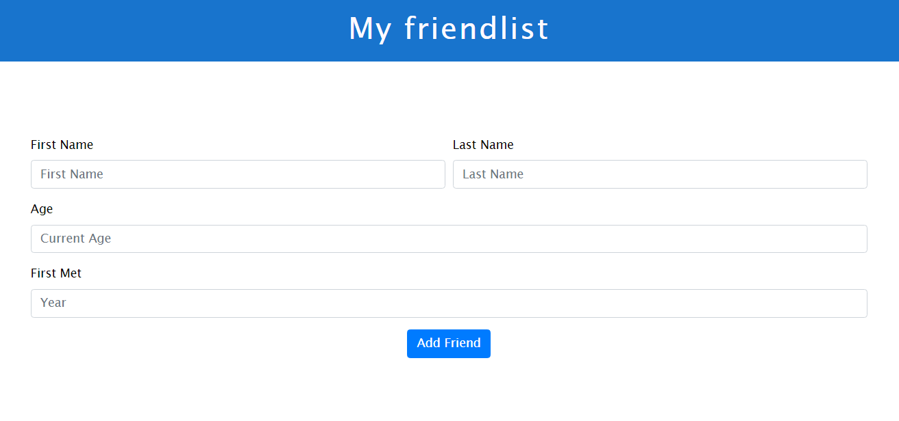

# 10 | Meine Freundesliste (Forms)

Erstellen Sie ein kleines Formular, mit welchem Sie ihre Freunde in einer Datenbank abspeichern können. Das Formular soll den Vor - und Nachnamen, das Alter sowie Ihre erste Begegnung mit dem/r jeweiligen  Freund/in abfragen. Nur der Vorname sowie das Alter müssen eingegeben werden, um die Daten abzuschicken. Die Datenbank soll dynamisch per node.js generiert werden. Verwenden Sie die Module der in der Vorlesung besprochenen Webanwendung "Kursbuch Medieninformatik". Verwenden Sie Bootstrap, um das Formular zu gestalten.

Die folgende Abbildung zeigt einen Ausschnitt aus dem User Interface:

{ height=12cm }

------

*Abgabekriterien:*

Laden Sie Ihre Antworten bis spätestens 21.07.2020 (23:59 Uhr) als zip-komprimierten Ordner auf GRIPS hoch. Benennen Sie die einzelnen Dateien pro Aufgabe sinnvoll und verwenden Sie geeignete Formate:

- Aufgabe 1: Ihr gesamtes Projekt

Der Name der Datei ergibt sich aus dem Präfix „Übung_WT_SS20“, der Nr. des Übungsblattes, ihrem Vor- und Nachnamen jeweils getrennt durch _ .

 

Beispiel: **Übung_WT_SS20_10_Max_Mustermann.zip**

